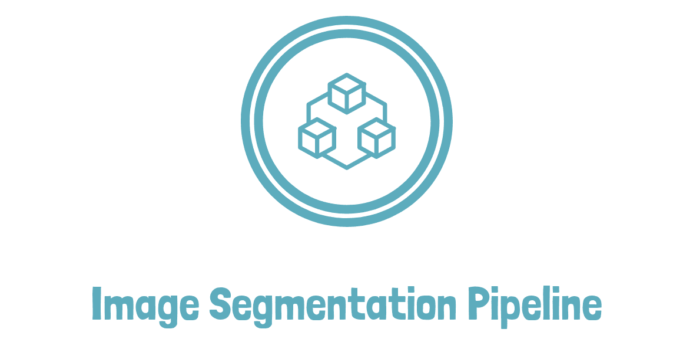
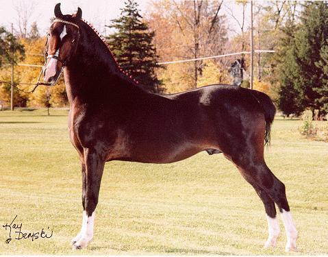
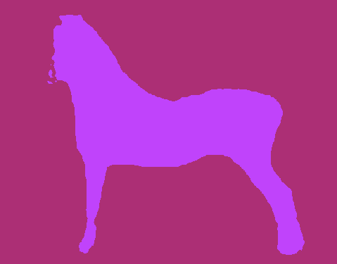

# Image-Segmentation-Pipeline

<p align="center">
  

[**Installation**](#0x01-installation) | [**Codebase Architecture**](#0x02-codebase-architecture) | [**Configs**](#0x03-config-format-interpretation) | [**Dataset Prepare**](#0x04-dataset-preparation) | [**Develop by Your Own**](#0x05-customized-usage)


This repository provides an easy to get started and modify pipeline for image segmentation task. Models from [segmentation_models.pytorch](https://github.com/qubvel/segmentation_models.pytorch) and [MMSegmentation](https://github.com/open-mmlab/mmsegmentation) can be applied as basic network architectures.

#### Demo (DeepLabV3+, trained on [Weizmann Horse Dataset](https://www.msri.org/people/members/eranb/weizmann_horse_db.tar.gz))

<table><tr>
<td></td>
<td></td>
</tr></table>

## 0x00 ChangeLog

- Nov 09, 2022  create codebase, including smp-based arch and mmseg-based arch, support folder dataloader for train and test


## 0x01 Installation

clone the current repository using git:
```
git clone https://github.com/jzsherlock4869/image-segmentation-pipeline.git
cd image-classification-pipeline
pip install -r requirements.txt
```

or you can use this repository as template and develop in your own way.

## 0x02 Codebase Architecture
The codebase is organized as follows:
+ [archs](./archs/) : network architectures
+ [data](./data/)
    + [data_augment](./data/data_augment/) : augmentation functions, you can design your own aug settings
    + [simple_folder_dataloader.py](./data/simple_folder_dataloader.py) : each class in each subfolder of dataroot
    + [infer_single_dataloader.py](./data/simple_folder_dataloader.py) : each class in each subfolder of dataroot
+ [datasets](./datasets/) : sample dataset for testing the codebase
+ [losses](./losses/) : implement customized losses, pre-implemented soft-ce-dice loss as example
+ [metrics](./metrics/) : metrics for evaluation, e.g. FWIoU, mIoU, Acc.
+ [models](./models/) : model class which contains data feeding, train, eval, save model, inference etc.
+ [options](./options/)
    + [train](./options/train/) : train configs in .yml format
    + [test](./options/test/) : test configs in .yml format (input only, and save results)
+ [scripts](./scripts/) : useful scripts for pre-/post-processing of datasets
+ [utils](./utils/) : utility functions collection
+ [train_imgseg.py](./train_imgseg.py) : train script which parses the config and run train/eval
+ [test_imgseg.py](./test_imgseg.py) : test script which parses the config and run inference


## 0x03 Config Format Interpretation

Here we use `options/train/000_horse_smparch_template.yml` as example to illustrate the format and meaning of necessary variables for the config yaml file.

```yaml
# basic settings
exp_name: ~  # empty, will be overwritten by filename when start training
model_type: BaselineModel  # corresponding to models folder (module), currently only basemodel
log_dir: ./tb_logger  # where the tensorboard logger saved
save_dir: ../exps_horse_test  # where the ckpts saved
device: cuda  # cuda or cpu
multi_gpu: false # if true, use all visible gpus to train

datasets:
  train_dataset:
    type: SimpleFolderDataloader #  refer to data module to find the implemented dataloaders
    dataroot_img: datasets/weizmann_horse_split/train_split/images  # data root for train images
    dataroot_lbl: datasets/weizmann_horse_split/train_split/masks  # data root for train masks
    img_exts: ['jpg'] # image extensions, support multiple different exts.
    lbl_exts: ['png'] # mask extensions
    augment:
      augment_type: simple_aug # augmentation type, name of data/data_augment/*.py
      size: 512 # params for augment function
    batch_size: 8
    num_workers: 4

  val_dataset: # val dataset params meanings the same as above
    type: SimpleFolderDataloader
    dataroot_img: datasets/weizmann_horse_split/valid_split/images
    dataroot_lbl: datasets/weizmann_horse_split/valid_split/masks
    img_exts: ['jpg']
    lbl_exts: ['png']
    augment:
      augment_type: simple_aug
      size: 512

train: # training settings, meaning as names
  num_epoch: 100
  model_arch:
    type: SMPArch
    load_path: ~
    backbone: DeepLabV3Plus
    in_channels: 3
    encoder_name: resnet50
    classes: 2

  optimizer:
    type: Adam
    lr: !!float 5e-4
    weight_decay: 0
    betas: [0.9, 0.99]

  scheduler:
    type: MultiStepLR
    milestones: [80]
    gamma: 0.1

  criterion:
    type: celoss  # support softceloss/diceloss/softce_diceloss

  metric:
    type: miou # supports miou/fwiou/acc

eval:
  eval_interval: 1  # eval model using val dataset each 1 epoch.

```


## 0x04 Dataset Preparation

Default dataset should be in the following format, or some modifications for dataloader should be made.

### Folder Format Dataset

```
dataroot/
    imgs/
        000.jpg
        001.jpg
    lbls/
        000_lbl.png
        001_lbl.png
    ...
```

## 0x05 Customized Usage

For simple training a semantic segmentation model, writing your own yml config (as shown in 0x03) is enough. But if the pre-implemented model cannot meet your requirement, you can also add/modify your own customized components in a minimal cost of development.

### add your own dataset

Write a `custom_dataloader.py` under `data` folder, and import the class in `__init__.py`, then you can select your customized dataloader classname in yml config.
Returned dict should be the same as `SimpleFolderDataset` if you still use `BaselineModel`, otherwise it is not restricted.

### add your own arch

Write a `custom_arch.py` under `archs` folder, and import the class in `__init__.py`. Then select in yml `model_arch -> type`, params to construct the arch should be passed using arguments under `load_path`.

### add your own model (to change train/eval/save/inference operations)

write a `custom_model.py` under `models` folder, and import in `__init__.py`. Model can be selected using `model_type` in yml config.

### add your own loss, metric etc.

refer to the `metrics` and `losses` can develop your own metric and loss class.
